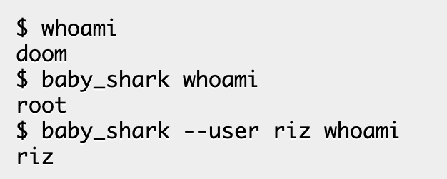
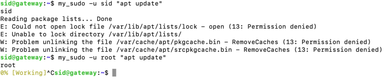
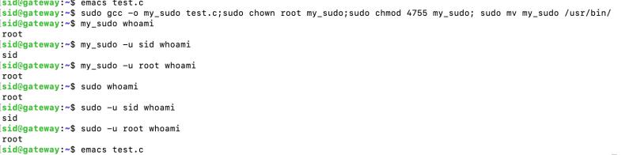
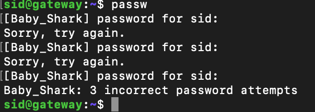
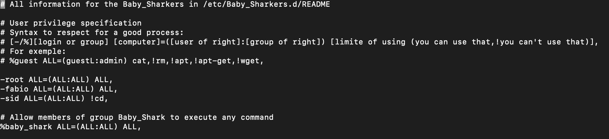
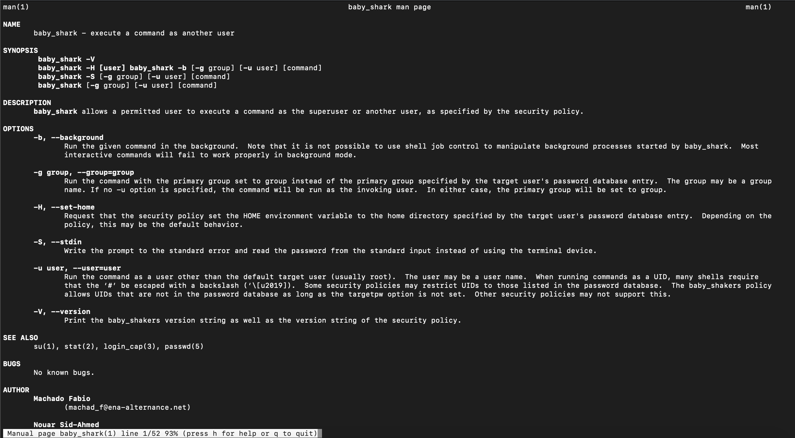

# Groupe de machad_f & nouar_a      Projet: Baby_Shark
Baby_Shark est un projet visant à recréer une version simplifiée de la commande sudo. 
En groupe de 2 à 3 nous avons une semaine pour rendre le meilleur projet possible.

## Premier jours:

### Decouverte du sujet:

Le sujet est simple et offre donc une marge de manoeuvre conséquente.

### Action de la journé:

Ne sachant comment se repartir le travail pour l'instant nous avons choisis de 
tout deux travailler sur une version basique, avec un seul but la même sortie que
dans l'exemple du sujet.

### Resultats:

Des avancées, connexion temporaire sur d'autres user toutefois le root n'est 
toujours pas accessible.

## Deuxième jours:

### Objectif de la journée:

Crée un Makefile, gestion des temps de log à Baby_Shark et sudo basic au point.

### Resultats: 

* À 11H le premier resultat probant tombe:

* copie du sujet:

* copie de la realité:

* avec un temps de session permettant de ne pas demander de mot de passe durant 15 minute après la dernière utilisation

## Troisième jours:

### Objectif de la journée:

Créer un système d'authentification et de configuration des permissions,
perfectionner le Makefile.

### Resultats: 

Les 2 permières étapes ok mais il manque toujours l'analyse des executables authorisé ou interdit.

* Type de paramétrage:

## Quatrième jours:

### Objectif de la journée:

Finir le système d'authentification et de configuration des permissions, debbug, création du man.

### Résultats:

resultats concluant tout les objectifs remplis.

## Cinquième jours:

### Objectif de la journée:

Création du Readme, tri des fonctions, debbug complet.

### Resultats:

